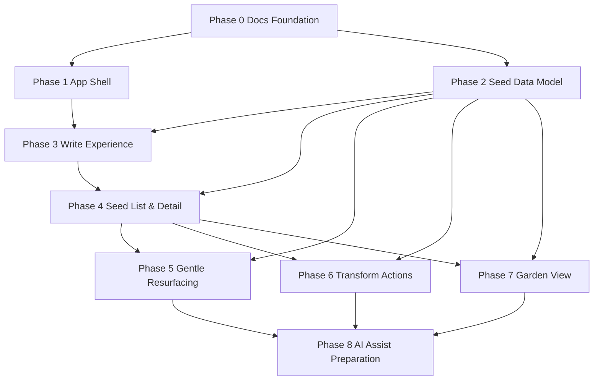

# Phase Dependency Map

## 概要
Phase 0〜8 は「思想固定 → UI土台 → データ基盤 → 書く/見返す体験 → 再浮上 → 変換 → 可視化 → AI準備」の順で依存する。

## Phaseごとの入力/出力/受け渡し

## Phase 0: Docs Foundation
- 入力: 構想・要求・非目標
- 出力: README / docs / AGENTS / Copilotルール
- 次Phaseへ渡すもの: 用語定義、MVP境界、Phase契約前提

## Phase 1: App Shell
- 入力: 画面要件（Home/Write/Seeds/Detail/Garden）
- 出力: 画面枠、ルーティング、仮データ遷移
- 次Phaseへ渡すもの: 画面構造、UIコンポーネント分割

## Phase 2: Seed Data Model
- 入力: MVP必須機能、architecture設計
- 出力: Seed型、CRUD、ローカル保存、Repository抽象
- 次Phaseへ渡すもの: 作成/更新/検索可能な安定データ層

## Phase 3: Write Experience
- 入力: App Shell + Data Model
- 出力: 低圧入力UI、最小メタ入力、保存導線
- 次Phaseへ渡すもの: 実データ投入された種

## Phase 4: Seed List & Detail
- 入力: 書き込み済み種データ、画面骨格
- 出力: 一覧、検索/フィルタ/ソート、詳細表示・更新
- 次Phaseへ渡すもの: 再浮上/変換/関係表示に使える閲覧編集基盤

## Phase 5: Gentle Resurfacing
- 入力: Seed履歴、更新時刻、重要度・気分・状態
- 出力: 今日の種、再浮上ロジック、表示理由
- 次Phaseへ渡すもの: 再会導線、再浮上候補

## Phase 6: Transform Actions
- 入力: Seed詳細、再浮上候補、テンプレルール
- 出力: 問い/タスク/記事案/プロジェクト案への変換UIと保存
- 次Phaseへ渡すもの: 変換結果と関連情報

## Phase 7: Garden View
- 入力: growthState、relatedSeedIds、一覧/詳細データ
- 出力: 軽量カード/簡易マップ可視化
- 次Phaseへ渡すもの: AI補助に渡せる関係表示要件

## Phase 8: AI Assist Preparation
- 入力: Resurfacing/Transform/Garden の利用実績と境界
- 出力: AIインターフェース、フォールバック、安全方針
- 次Phaseへ渡すもの: 本格AI導入時の接続点と検証計画

## 危険な依存
1. **Phase 2未確定でPhase 5/6/7へ進むこと**
   - 再浮上・変換・関係表示が個別最適化され、データ不整合が起きる。
2. **Phase 6保存仕様なしでUI先行**
   - 変換結果の保存先が後付けになり再作業が発生。
3. **Phase 7で重い可視化を先取り**
   - Non-Goals違反（重い3D/複雑グラフ）に直結。
4. **Phase 8を前倒ししすぎる**
   - AI前提化によりMVPの低圧体験を損なう。

## 並列化できる作業
- Phase 1内: Home/Write/Seeds/Detail の画面枠実装（共通Shell前提）。
- Phase 2内: 型定義とRepository抽象化の草案作成。
- Phase 4内: 一覧UIと詳細UIの実装（API契約を固定すれば可能）。
- ドキュメント整備: Review Policy強化とPRテンプレ整備。

## 並列化しない方がよい作業
- Phase 5（再浮上ロジック）と Phase 2（モデル確定）の同時進行。
- Phase 6（変換保存）と Phase 4（詳細編集基盤）の同時進行。
- Phase 7（Garden）を Phase 4前に開始すること。
- Phase 8（AI準備）を Phase 5/6/7未確定で開始すること。
